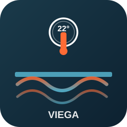

# Viega Fonterra Smart Control

  

**Home Assistant custom integration for Viega Fonterra Smart Control floor heating via Modbus TCP.**

Built based on the extensive community thread:  
https://community.home-assistant.io/t/viega-floorheating-fonterra-smart-control/284753

---

## Features

- One `climate` entity per heating zone (current temperature, target temperature, on/off)
- Additional sensors (outdoor temperature, pump status, error codes, etc.)
- Full Modbus register mapping based on Viega manual and community contributions
- Configurable via the UI (Config Flow)
- Robust error handling and automatic reconnection
- Uses `pymodbus` for direct Modbus TCP communication

---

## Important Viega Device Configuration

**Before adding the integration you must configure the Viega device itself:**

1. Activate Modbus TCP in the Viega app or web interface of the WiFi module.
2. Assign a **static IP address** to the WiFi module in your router (very important for stable connection).

See the community thread for screenshots of the Viega configuration screens.

**Viega Manual (register map on page 105+):**  
[Download PDF](https://web-catalog.viega.com/de_DE/html/Montage/Flaechentemperierung/Fonterra/1a86c459c36246e4ac114094093e2e46_7_de_DE/pdf/ga_fonterra-smart-control_7_de_de.pdf)

---

## Installation

Click the button at the top of this page or add this repository manually in HACS:

- **Repository**: `matrover/viega-fonterra`
- **Category**: `Integration`

After installation, go to **Settings → Devices & Services → Add Integration** and search for **Viega Fonterra Smart Control**.

---

## Configuration

The integration is configured through the UI. You will be asked for:
- Modbus Host (IP address of the Fonterra WiFi module)
- Port (default 502)
- Your heating zones (one per line)

**Important note from the community:** For correct current temperature reading, make sure to use `current_temp_register_type: input` (this was the solution for the common -9.9°C error).

---

## Register Map (summary)

| Register | Type   | Description                  | Scaling |
|----------|--------|------------------------------|---------|
| 50+x     | Input  | Current temperature zone x   | ×0.1    |
| 51+x     | Holding| Target temperature zone x    | ×0.1    |
| 100      | Input  | Outdoor temperature          | ×0.1    |
| 200+     | Holding| Pump status, errors, etc.    | -       |

Full mapping is implemented in the code (`climate.py` and `sensor.py`).

---

## Support

Report issues on [GitHub Issues](https://github.com/matrover/viega-fonterra/issues).

This integration has **not yet been tested on live hardware** — testing feedback is very welcome.

---

**Repository:** https://github.com/matrover/viega-fonterra
